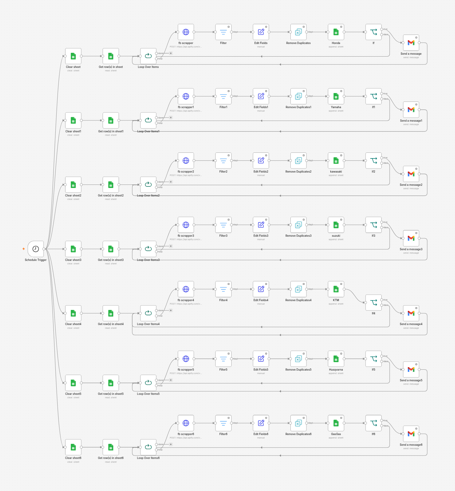

# Marketplace Deal-Finder — n8n Automation

Automated deal-sourcing system that monitored **Facebook Marketplace and eBay 24/7** for underpriced dirt bikes (Honda, Yamaha, Kawasaki, Suzuki, KTM, Husqvarna, GasGas), built and deployed for a motorcycle reseller client. It scanned thousands of listings per hour, flagged items priced below retail benchmarks, and fired instant "🔥 New Deal Found" email alerts — giving the client first-mover advantage on undervalued bikes.

Over its run it delivered 2,800+ deal alerts and generated ~$1,000 in commissions.

## How it works

1. **Schedule Trigger** fires the pipeline on a fixed interval, around the clock
2. **Apify scrapers** (HTTP Request nodes) pull fresh listings from brand-specific Marketplace/eBay search URLs — the Facebook workflow runs **7 parallel brand branches**
3. **Filter + Remove Duplicates** drop already-seen listings, using Google Sheets as the state store
4. **Price logic** flags listings under the retail benchmark for that model
5. **Gmail nodes** send an instant alert with the listing link the moment a deal is detected
6. Results are **logged per-brand to Google Sheets** for tracking and analysis

## Files

| File | Description |
|---|---|
| `Deal-Finder_FacebookMarketplace.json` | Facebook Marketplace pipeline — 71 nodes, 7 parallel brand branches |
| `Deal-Finder_eBay.json` | eBay pipeline — 28 nodes |

## Run it yourself

1. Import a workflow into n8n: **Workflows → Import from File**
2. Connect your own credentials on the Gmail and Google Sheets nodes
3. Replace `YOUR_APIFY_TOKEN` in the HTTP Request nodes with your [Apify](https://apify.com) API token
4. Point the `YOUR_SHEET_ID_*` placeholders at your own spreadsheets and set your alert recipient
5. Enable the Schedule Trigger and activate the workflow

*Note: all credentials, API tokens, sheet IDs, and personal emails have been replaced with placeholders. Scraping marketplaces may conflict with platform terms of service — this system ran via Apify actors for a private client; use responsibly.*
